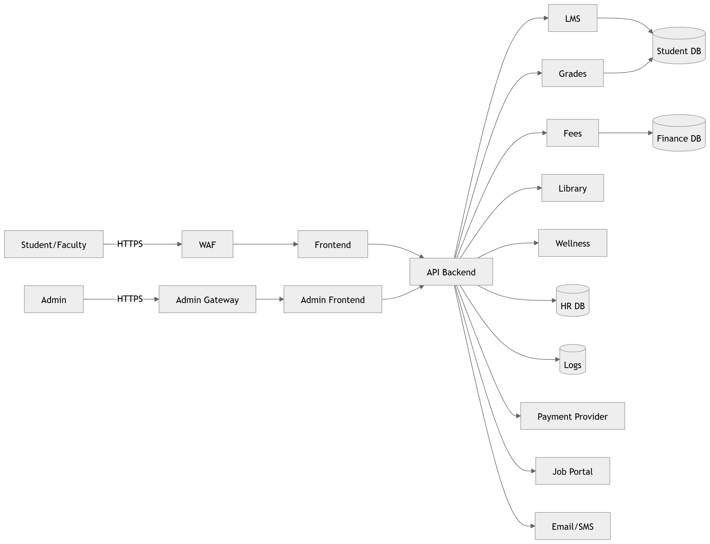
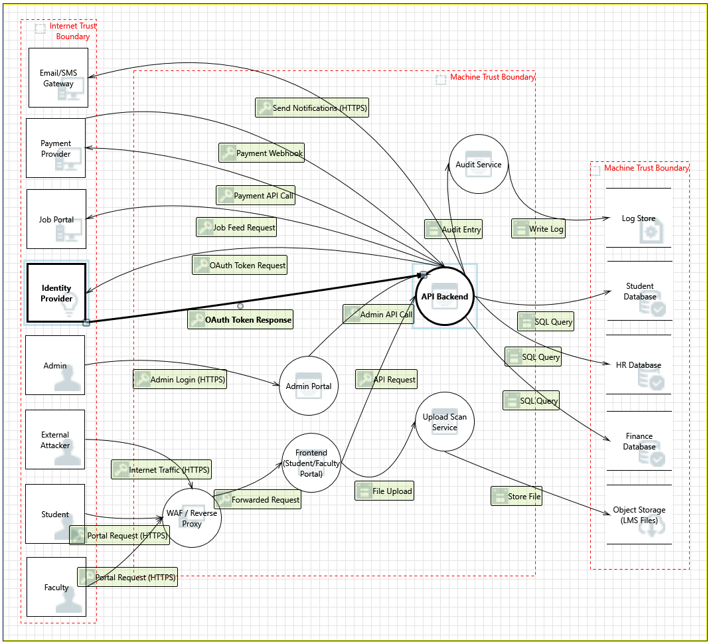
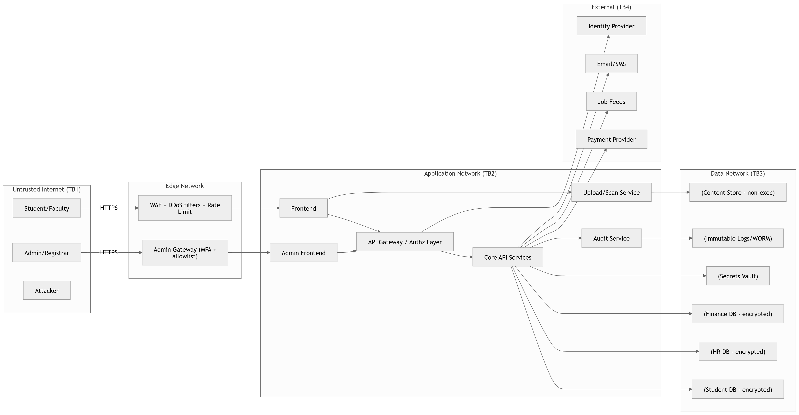

# Secure Architecture & Threat Modeling Report  
## University Management System (UMS)

---

# 1. System Overview

## 1.1 Purpose

The University Management System (UMS) is an internet-facing enterprise platform that supports:

- Student access: LMS, Attendance, Fees, Grades, Alumni, Wellness, Library Management
- Faculty access: LMS, Attendance, Salary information, Course management, Library, Wellness
- Administrative / Registrar functions: Student records, Academic management, Financial operations, Role provisioning
- External integrations: Payment providers, Job portal feeds, Email/SMS gateways, Identity provider (SSO)

The system is cloud-agnostic and accessible over the public internet. Both external attackers and insider threats are considered.

---

## 1.2 Assumptions

- System is accessible over the public internet.
- Users authenticate via centralized Identity Provider (IdP).
- System stores sensitive personal and financial data.
- Administrative users have high-impact privileges.
- Third-party integrations are untrusted by default.
- Secure development lifecycle is partially implemented but not assumed perfect.
- The deployment environment follows standard enterprise practices.
- Security must be implemented at architectural level, not only at code level.

---

# 2. System Definition and Architecture

## 2.1 Application Components

### 2.1.1 User-Facing Applications

#### A. Student/Faculty Web Frontend

The Student/Faculty Web Frontend is a browser-accessible portal that provides a unified interface for student and faculty features. It serves as the primary internet-facing entry point for standard users.

**Core Responsibilities:**
- Session management and authenticated access to UMS features  
- Rendering UI for LMS, attendance, fees, grades, library, wellness, and alumni services  
- Sending requests to backend APIs over HTTPS  

**Security Relevance:**
- Target for phishing, session hijacking, XSS, and CSRF  
- Must not directly access databases or secrets  
- Relies entirely on backend authorization enforcement  

---

#### B. Admin Portal Frontend

A separate web interface dedicated to Registrar and administrative operations. Administrative access is routed through a distinct path to reduce risk exposure.

**Core Responsibilities:**
- High-privilege workflows: grade overrides, student record edits, fee adjustments  
- Role provisioning and system-level administrative actions  
- Communicates with backend APIs via HTTPS  

**Security Relevance:**
- High-impact target due to elevated privileges  
- Compromise may lead to full system control  
- Requires enhanced authentication and monitoring controls  

---

### 2.1.2 Edge / Access Layer Components

#### C. Edge: WAF / Reverse Proxy

Serves as the first security boundary between the public internet and internal services.

**Core Responsibilities:**
- Termination and forwarding of HTTPS traffic  
- Request filtering and baseline threat protection  
- Routing traffic to appropriate frontend service  

**Security Relevance:**
- First line of defense against scanning, injection, and volumetric attacks  
- Defines the Internet Trust Boundary (TB1)  

---

#### D. Admin Edge Gateway

Dedicated gateway for administrative traffic.

**Core Responsibilities:**
- Segregation of admin traffic from general portal traffic  
- Enforcement of stricter access policies for administrative users  

**Security Relevance:**
- Reduces blast radius  
- Limits exposure of high-privilege interfaces  

---

### 2.1.3 Core Application Services

#### E. API Backend (Core Business Logic)

Central backend responsible for processing business operations and coordinating data access.

**Core Responsibilities:**
- Authentication validation using IdP tokens  
- Authorization enforcement (RBAC)  
- Execution of business logic  
- Communication with internal services and databases  
- Writing audit logs  

**Security Relevance:**
- Primary enforcement point for integrity and access control  
- Central component for preventing privilege escalation  

---

#### F. Internal Services (LMS / Fees / Grades / Library / Wellness)

Logical service modules representing functional areas of the UMS.

**LMS:** Assignment management and content delivery  
**Fees:** Invoice generation and payment management  
**Grades:** Transcript and GPA management  
**Library:** Borrowing and fines management  
**Wellness:** Appointment scheduling and personal services  

**Security Relevance:**
- Each service handles sensitive academic or personal data  
- Different services carry different confidentiality and integrity risks  

---

### 2.1.4 Identity and Security Supporting Services

#### G. Identity Provider (IdP / Auth Service)

Centralized authentication service used for user login and token issuance.

**Core Responsibilities:**
- User authentication  
- Token issuance for SSO  
- Possibly MFA enforcement  

**Security Relevance:**
- Compromise can lead to spoofing attacks  
- Authentication must remain distinct from authorization  

---

#### H. Central Logs + Audit

Centralized audit storage and logging system.

**Core Responsibilities:**
- Record security events  
- Store administrative action logs  
- Provide forensic traceability  

**Security Relevance:**
- Supports accountability and non-repudiation  
- Log integrity must be protected against tampering  

---

### 2.1.5 Data Stores

#### I. Student Database

Stores student records including:

- Personal identification information  
- Academic records (grades, attendance)  
- Enrollment status  

**Security Objective:** Confidentiality and Integrity  

---

#### J. Faculty/HR Database

Stores:

- Faculty profiles  
- Salary and payroll data  
- Employment contracts  

**Security Objective:** High Confidentiality  

---

#### K. Finance Database

Stores:

- Fee invoices  
- Payment status  
- Financial adjustments  

**Security Objective:** Integrity and Availability  

---

#### L. Content Store

Stores:

- LMS files and submissions  
- Course materials  

**Security Objective:** Confidentiality, Integrity, Availability  

---

## 2.2 Users and Roles

### 2.2.1 Primary Internet-Facing Users

#### Student

**Capabilities:**
- Access grades and attendance  
- Submit assignments  
- View fee status  

**Security Considerations:**
- Account takeover exposes personal data  

---

#### Faculty

**Capabilities:**
- Manage course content  
- Post grades  
- Mark attendance  

**Security Considerations:**
- Can affect multiple students  
- Grade manipulation risk  

---

#### Admin / Registrar

**Capabilities:**
- Modify student records  
- Override grades  
- Manage roles and privileges  

**Security Considerations:**
- Highest privilege  
- Insider abuse risk  

---

### 2.2.2 Internal Operational Users

#### IT Operations

- Infrastructure management  
- Deployment and system monitoring  

#### Database Administrators

- Database maintenance  
- Backup management  

**Security Consideration:**  
Privileged insider access must be monitored and restricted.

---

### 2.2.3 External Actors

#### Third Parties

- Payment Provider  
- Job Portal  
- Email/SMS Gateway  

#### External Attacker

- Credential stuffing  
- Injection attacks  
- Denial of Service  
- Phishing  

---

## 2.3 Data Types Handled

### 2.3.1 Identity and Authentication Data

- Login credentials  
- Session tokens  
- Role claims  

**Security Objective:** Confidentiality and Integrity  

---

### 2.3.2 Personally Identifiable Information (PII)

- Names  
- Contact details  
- Enrollment information  

**Security Objective:** Confidentiality  

---

### 2.3.3 Academic Data

- Grades  
- Attendance records  
- GPA calculations  

**Security Objective:** Integrity and Accountability  

---

### 2.3.4 Financial Data

- Fee invoices  
- Payment status  
- Transaction references  

**Security Objective:** Integrity and Availability  

---

### 2.3.5 HR / Salary Data

- Payroll information  
- Employment records  

**Security Objective:** High Confidentiality  

---

### 2.3.6 LMS Content

- Student submissions  
- Course materials  

**Security Objective:** Confidentiality and Integrity  

---

### 2.3.7 Security and Audit Logs

- Login events  
- Admin actions  
- API access logs  

**Security Objective:** Integrity and Accountability  

---

## 2.4 External Dependencies

### 2.4.1 Identity Provider (IdP)

Provides centralized authentication services.

**Risk:** Login failure if unavailable; spoofing if misconfigured.

---

### 2.4.2 Payment Provider

Handles financial transactions and callbacks.

**Risk:** Webhook spoofing; dependency on provider availability.

---

### 2.4.3 Job Portal / Company Feeds

Provides job listing data.

**Risk:** Untrusted input and potential malicious payloads.

---

### 2.4.4 Email/SMS Gateway

Handles notification delivery.

**Risk:** Phishing amplification; delivery failures; privacy exposure.

---

## 2.5 Trust Boundaries

The following trust boundaries are defined:

- **TB1 – Internet Boundary**  
  Between external users and the university edge infrastructure.
  Untrusted traffic enters (students/faculty/admin)

- **TB2 – Application Boundary**  
  Between edge infrastructure and backend services.
  Only controlled service-to-service access

- **TB3 – Data Boundary**  
  Between application services and databases.
  Strictly segmented, least privilege

- **TB4 – Third-Party Boundary**  
  Between university services and external providers.
  Payment + job portal integrations (untrusted inputs)

---

## 2.6 Initial Architecture Diagram

The architecture consists of:

- Web frontend
- Admin frontend
- API backend
- LMS, Fees, Grades, Library, Wellness services
- Student, HR, and Finance databases
- Logging system
- Third-party integrations

Administrative traffic is routed separately from student/faculty traffic.

---

# 3. Asset Identification & Security Objectives

Full asset list available in:

- [Asset Inventory (CSV)](./tables/asset-inventory.csv)

## 3.1 Critical Assets

The following assets are considered critical due to their sensitivity, business impact, or privilege level within the University Management System (UMS):

1. **Credentials & Authentication Tokens**
   - User passwords
   - Session tokens
   - OAuth/SSO tokens
   - Multi-factor authentication (MFA) factors

2. **Student Personally Identifiable Information (PII)**
   - Names and student IDs
   - Contact details
   - Enrollment information

3. **Academic Records**
   - Grades
   - Transcripts
   - GPA calculations
   - Attendance records

4. **Financial Data**
   - Fee invoices
   - Payment status
   - Refunds and adjustments
   - Transaction references

5. **Faculty HR and Salary Data**
   - Payroll records
   - Employment contracts
   - Compensation information

6. **LMS Content and Submissions**
   - Assignment uploads
   - Course materials
   - Student submissions

7. **Administrative Privileges and Role Assignments**
   - Registrar-level authority
   - Role provisioning rights
   - Access control policies

8. **Audit Logs and Security Logs**
   - Login attempts
   - Grade modifications
   - Fee adjustments
   - Privilege changes

9. **API Secrets and Integration Keys**
   - Payment provider API keys
   - Webhook verification secrets
   - Email/SMS gateway credentials

10. **System Configuration and Business Logic Rules**
    - Fee calculation rules
    - GPA calculation logic
    - Authorization policies

## 3.2 Security Objectives

Security objectives are derived from the CIA model (Confidentiality, Integrity, Availability) with Accountability added due to the administrative sensitivity of the system.

### Confidentiality

Prevent unauthorized disclosure of:
- Student PII
- Faculty salary data
- Authentication tokens
- API secrets
- Sensitive LMS content

Confidentiality is critical due to privacy requirements and institutional reputation risks.

---

### Integrity

Ensure that:
- Grades and transcripts cannot be altered without authorization
- Attendance records remain accurate
- Financial records cannot be manipulated
- Audit logs cannot be tampered with
- Role assignments are correctly enforced

Integrity is particularly critical in academic and financial contexts.

---

### Availability

Ensure system availability during:
- Registration periods
- Examination result publication
- Fee payment deadlines

Availability ensures operational continuity and institutional reliability.

---

### Accountability

Ensure that:
- All sensitive administrative actions are traceable
- Privileged actions require authenticated identity
- Audit trails cannot be repudiated
- Actions can be attributed to a uniquely authenticated user

---

# 4. Threat Modelling

## 4.1 STRIDE

**Spoofing:** Spoofing is when a process or entity is something other than its claimed identity. Examples include substituting a process, a file, website or a network address.

**Tampering:** Tampering is the act of altering the bits. Tampering with a process involves changing bits in the running process. Similarly, Tampering with a data flow involves changing bits on the wire or between two running processes.

**Repudiation:** Repudiation threats involve an adversary denying that something happened.

**Information Disclosure:** Information disclosure happens when the information can be read by an unauthorized party.

**Denial of Service:** Denial of Service happens when the process or a datastore is not able to service incoming requests or perform up to spec.

**Elevation of Privilege:** A user subject gains increased capability or privilege by taking advantage of an implementation bug.

---

## 4.2 Threat Model/Annotated Architecture

---

## 4.3 Threat Table
- [Threat Model Table (CSV)](./tables/threat-model-table.csv)

---

## 5.1 Updated Secure Architecture Diagram (v2)

The secure redesign introduces stronger trust-boundary enforcement, separation of admin and user planes, centralized secrets management, and improved observability.

**Updated Secure Architecture Diagram:**

---

## 5.2 Identity and Access Management (IAM)

### Controls
1. **Centralized authentication via Identity Provider (SSO)**
   - Use standards-based SSO (OIDC/SAML) for all users (students, faculty, admin).

2. **Mandatory MFA for privileged roles**
   - Enforce MFA for Admin/Registrar and optionally Faculty roles.

3. **Role-Based Access Control (RBAC) at the API Backend**
   - All authorization decisions occur at the API layer (server-side), not in the frontend.
   - Deny-by-default access policy for sensitive endpoints.

4. **Step-up authentication for high-risk admin actions**
   - Require re-authentication / step-up MFA for actions like grade overrides, fee adjustments, role changes.

### Justification
- Reduces **Spoofing** risk (credential stuffing, token theft) and limits damage if a user session is compromised.
- Ensures authorization is enforced consistently at a trusted layer, addressing **Elevation of Privilege** and **IDOR**-style threats.

---

## 5.3 Network Segmentation and Trust Boundary Enforcement

### Controls
1. **Separate admin plane from user plane**
   - Maintain distinct access paths:
     - Student/Faculty → WAF/Reverse Proxy → Web Frontend → API
     - Admin → Admin Edge Gateway → Admin Portal → API

2. **Edge protection layer**
   - Place WAF/Reverse Proxy in front of public endpoints.
   - Add rate limiting and request filtering at the edge.

3. **Application network isolation**
   - Place API Backend and internal services in an application network segment.
   - Only allow inbound traffic from the frontends/gateways.

4. **Data network isolation**
   - Place databases and log stores in a separate data segment.
   - Only allow database access from API Backend (no direct access from frontends).

### Justification
- Clear trust boundaries reduce attack surface and enforce least privilege between tiers.
- Contains lateral movement: compromise of a frontend should not grant direct database access.
- Improves resilience against **DoS** and reduces exposure to **Tampering / Information Disclosure** threats.

---

## 5.4 Data Protection

### Controls
1. **Encryption in transit (TLS)**
   - Enforce TLS for all browser-to-system and system-to-third-party communication.
   - Use mutual TLS or equivalent internal transport security for sensitive internal service calls where possible.

2. **Encryption at rest**
   - Encrypt:
     - Student DB
     - HR DB
     - Finance DB
     - Backups
     - Sensitive logs (where appropriate)

3. **Data minimization and access scoping**
   - Services access only required data for their function (least-privileged data access).
   - Faculty access scoped to course-related students only (policy enforced by backend authorization).

4. **Secure file handling for LMS content**
   - Store uploads in a non-executable content store.
   - Introduce an upload scanning/validation service in the secure architecture.

### Justification
- Protects confidentiality of PII, HR salary data, and financial records.
- Prevents integrity attacks against grades/fees and reduces the impact of storage compromise.
- Mitigates file upload abuse and malware distribution risks.

---

## 5.5 Secrets Management

### Controls
1. **Centralized Secrets Vault**
   - Introduce a Secrets Vault in the data trust boundary (v2).
   - API Backend retrieves:
     - Database credentials
     - Payment provider API keys
     - Webhook verification secrets
     - Email/SMS gateway credentials

2. **Least privilege access to secrets**
   - Only backend services (primarily API Backend) can access the vault.
   - Frontends never store long-term secrets.

3. **Rotation and separation of secrets**
   - Separate secrets per environment (dev/test/prod).
   - Rotate high-value secrets (payment keys, webhook secrets, DB creds).

### Justification
- Reduces blast radius of credential exposure and prevents secrets being embedded in configs or code.
- Strongly mitigates **Information Disclosure** and downstream **Elevation of Privilege** resulting from stolen keys.

---

## 5.6 Monitoring and Logging

### Controls
1. **Centralized logging + immutable audit trail**
   - Centralize security logs and application logs.
   - Ensure privileged actions (admin workflows) create audit entries.

2. **High-value audit events**
   - Track (at minimum):
     - Authentication attempts (success/failure)
     - Role changes / privilege grants
     - Grade overrides and transcript edits
     - Fee status changes and manual adjustments
     - Bulk data exports
     - Payment webhook processing outcomes

3. **Alerting and anomaly detection**
   - Alert on:
     - Multiple failed logins
     - Unusual admin activity
     - Large/rapid grade changes
     - Suspicious payment webhook patterns
     - Access from unexpected geographies/devices (if available)

4. **Log integrity protections**
   - Restrict who can modify logs.
   - Use append-only storage / integrity checks to reduce tampering.

### Justification
- Supports **Accountability** and non-repudiation (users cannot credibly deny actions).
- Enables rapid detection and containment of both external attacks and insider misuse.
- Mitigates **Repudiation** and reduces time-to-detect/time-to-respond.

---

## 5.7 Secure Deployment Practices

### Controls
1. **Environment separation**
   - Separate dev/test/prod environments and credentials.
   - Prevent test systems from accessing production data.

2. **Hardened CI/CD pipeline**
   - Protected branches, mandatory reviews.
   - Signed build artifacts and controlled deployment permissions.
   - Restrict who can trigger production deploys.

3. **Least privilege service identities**
   - Each service runs with minimal permissions required.
   - Remove shared admin credentials for infrastructure tasks.

4. **Baseline configuration hardening**
   - Secure defaults (deny by default inbound).
   - Regular patching and vulnerability scanning (dependency + container/image scanning).

### Justification
- Reduces supply-chain and deployment compromise risks.
- Prevents unauthorized modification of the production system.
- Limits impact of credential leakage in build/deploy processes.

---

## 5.8 Control-to-Threat Coverage Summary

| Control Area | What It Mitigates (Examples) |
|---|---|
| IAM (SSO, MFA, RBAC, step-up auth) | Spoofing, Elevation of Privilege, Unauthorized access, IDOR-type abuse |
| Network segmentation + trust boundaries | Lateral movement, Data exposure, Reduced attack surface, Containment |
| Data protection (TLS, encryption at rest, secure file handling) | Information disclosure, Tampering, Malware upload impacts |
| Secrets management (vault, rotation, least privilege) | Key leakage, Webhook spoofing impact, DB credential compromise |
| Monitoring + audit logs | Repudiation, Insider abuse detection, Incident investigation |
| Secure deployment practices | Supply-chain compromise, unauthorized deployment, configuration drift |

---

# 6. Risk Treatment and Residual Risk

Following structured threat modeling and risk prioritization, high-risk threats were evaluated using standard risk treatment strategies:

- Mitigate
- Transfer
- Accept
- Avoid

Each high-risk threat was assigned a treatment strategy based on impact, likelihood, feasibility of control implementation, and operational necessity.

---

## 6.1 Risk Treatment Strategy

### 6.1.1 Mitigate

The majority of high-risk threats are mitigated through architectural controls introduced in Section 4.

Examples include:

- SQL Injection → Mitigated through parameterized queries, strict input validation, and least-privilege database access.
- Elevation of Privilege → Mitigated via RBAC enforcement, API Gateway authorization, MFA for admin roles, and deny-by-default access.
- Cross-Site Scripting (XSS) → Mitigated using output encoding, Content Security Policy (CSP), and input sanitization.
- Cross-Site Request Forgery (CSRF) → Mitigated through CSRF tokens and secure cookie configuration.
- Secrets Exposure → Mitigated by introducing a centralized Secrets Vault with controlled access and rotation policies.

Mitigation was chosen where:

- The threat directly affects Confidentiality, Integrity, or privileged access.
- Controls are feasible at the architectural level.
- The risk is unacceptable if left unaddressed.

---

### 6.1.2 Transfer

Certain risks associated with third-party services are partially transferred through contractual and compliance mechanisms.

Examples:

- Payment processing risks → Transferred to certified external payment providers compliant with financial security standards.
- Email/SMS delivery risks → Transferred to managed notification providers.

Transfer was selected where:

- The functionality depends on third-party infrastructure.
- Security responsibility is shared under formal agreements.
- Risk cannot be fully eliminated by internal architectural controls.

However, webhook validation and API authentication remain internally mitigated to prevent spoofing or tampering.

---

### 6.1.3 Accept

Some residual risks remain despite implemented controls.

Example:

- Denial of Service (DoS) attacks.

Although WAF protection, rate limiting, and network segmentation reduce impact, complete elimination of DoS risk is impractical for any internet-facing system.

Acceptance was chosen where:

- Mitigation reduces impact but cannot eliminate exposure.
- Further control would introduce disproportionate cost or complexity.
- Residual risk remains within acceptable operational tolerance.

---

### 6.1.4 Avoid

No high-risk threats were categorized as "Avoid".

Avoidance would require removal of essential system functionality such as:

- Payment processing
- Identity integration
- File uploads
- Administrative access

Since these functions are core to university operations, avoidance is not feasible.

---

## 6.2 Residual Risk Analysis

Even after mitigation and transfer strategies, certain residual risks remain:

1. Advanced persistent attackers may still attempt sophisticated exploitation despite layered controls.
2. Credential compromise through user behavior (phishing, password reuse) remains partially outside system control.
3. External provider outages (payment gateway, IdP) may impact availability.
4. Distributed Denial of Service attacks cannot be fully prevented.

These residual risks remain because:

- The system is publicly accessible.
- Human behavior cannot be fully controlled.
- Third-party dependencies introduce shared responsibility.
- Security operates on risk reduction, not absolute elimination.

However, defense-in-depth architecture, monitoring, audit logging, and strict identity controls reduce both likelihood and impact to acceptable levels.

---

## 6.3 Summary

Risk treatment decisions were made based on:

- Business necessity
- Impact severity
- Feasibility of architectural control
- Operational practicality

The secure architecture introduced in Section 4 significantly reduces the attack surface while maintaining system functionality.

Residual risks are acknowledged and continuously monitored as part of ongoing security governance.
